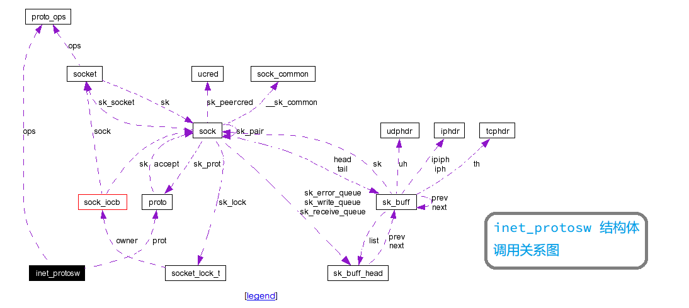

	本篇文章分析 proto_ops 结构体的具体内容及其初始化

## 1 proto_ops 结构体的说明

```cpp
/*
 * net.h，孙小强，2016年11月30日17:25:54
 * struct proto_ops 结构体的定义
 * line 00095
 */
struct proto_ops {
    int             family;

#if 0
/*socket.h*/
00152 #define AF_UNSPEC       0
00153 #define AF_UNIX         1       /* Unix domain sockets          */
00154 #define AF_LOCAL        1       /* POSIX name for AF_UNIX       */
00155 #define AF_INET         2       /* Internet IP Protocol         */
...
00181 #define AF_MAX          32      /* For now.. */
...
#endif

    struct module   *owner;

#if 0
/*用来表示所属模块的 module 结构体指针*/
#endif

    int             (*release)   (struct socket *sock);
    int             (*bind)      (struct socket *sock,
                                  struct sockaddr *myaddr,
                                  int sockaddr_len);
    int             (*connect)   (struct socket *sock,
                                  struct sockaddr *vaddr,
                                  int sockaddr_len, int flags);
    int             (*socketpair)(struct socket *sock1,
                                  struct socket *sock2);
    int             (*accept)    (struct socket *sock,
                                  struct socket *newsock, int flags);
    int             (*getname)   (struct socket *sock,
                                  struct sockaddr *addr,
                                  int *sockaddr_len, int peer);
    unsigned int    (*poll)      (struct file *file, struct socket *sock,
                                  struct poll_table_struct *wait);
    int             (*ioctl)     (struct socket *sock, unsigned int cmd,
                                  unsigned long arg);
    int             (*listen)    (struct socket *sock, int len);
    int             (*shutdown)  (struct socket *sock, int flags);
    int             (*setsockopt)(struct socket *sock, int level,
                                  int optname, char __user *optval, int optlen);
    int             (*getsockopt)(struct socket *sock, int level,
                                  int optname, char __user *optval, int __user *optlen);
    int             (*sendmsg)   (struct kiocb *iocb, struct socket *sock,
                                  struct msghdr *m, size_t total_len);
    int             (*recvmsg)   (struct kiocb *iocb, struct socket *sock,
                                  struct msghdr *m, size_t total_len,
                                  int flags);
    int             (*mmap)      (struct file *file, struct socket *sock,
                                  struct vm_area_struct * vma);
    ssize_t         (*sendpage)  (struct socket *sock, struct page *page,
                                  int offset, size_t size, int flags);
#if 0
/*
 * 以上，是一组与系统调用相对应的传输层函数指针。
 * 因此整个 proto_ops 结构体可以看做是一张套接字系统调用到传输层函数的跳转表。
 * 其中某些操作会继续通过 proto 结构跳转，进入具体的传输层或者网络层的处理。
 * 
 * proto_ops 结构体是与协议无关的套接字层到协议相关的传输层的转接
 * proto     结构体是传输层映射到网络层的转换
 * 
 */
#endif
};
```
## 2 proto_ops 结构体的初始化
```cpp
proto_ops 结构体的初始化与一下两个数据结构有关
           1. inet_protosw 结构体数组 inetsw_array[]
           2. list_head    结构体数组 inetsw[]
```
### 2.1.1 inet_protosw 结构体的调用关系图



### 2.1.2 inet_protosw 结构体的说明

```cpp
/*
 * protocol.h，孙小强，2016年11月30日18:05:23
 * struct inet_protosw 结构体的定义
 * line 00095
 */
struct inet_protosw {
    struct list_head list;

#if 0
/*list_head 结构体用来将该结构体连接成一个双向链表，用来查询*/
#endif

    unsigned short   type;     /* This is the 2nd argument to socket(2). */

#if 0
/*net.h*/
1. 该类型与socket() 系统调用的第二个参数相同
2. 与 socket 结构体中 type 的可取值相同
#endif

    int              protocol;

#if 0
/*Linux/include/uapi/linux/in.h*/
enum {
28   IPPROTO_IP = 0,               /* Dummy protocol for TCP               */
36   IPPROTO_TCP = 6,              /* Transmission Control Protocol        */
42   IPPROTO_UDP = 17,             /* User Datagram Protocol               */
79 };
#endif

    struct proto     *prot;

#if 0
/*proto     结构体是传输层映射到网络层的转换*/
#endif

    struct proto_ops *ops;

#if 0
/*proto_ops 结构体是与协议无关的套接字层到协议相关的传输层的转接*/
#endif

    int              capability; 

#if 0
/*操作这类别套接字所需要的权限*/
#endif

    char             no_check;   

#if 0
/*套接字对应的传输模块是否需要校验*/
#endif

    unsigned char    flags; 

#if 0
00078 #define INET_PROTOSW_REUSE 0x01      /* 端口可重用 */
00079 #define INET_PROTOSW_PERMANENT 0x02  /* 永久协议不可以被移除 */
#endif
};
```

### 2.1.3 inetsw_array 数组

```cpp

static struct inet_protosw inetsw_array[] =
{
    {
         .type =       SOCK_STREAM,
         .protocol =   IPPROTO_TCP,
         .prot =       &tcp_prot,
         .ops =        &inet_stream_ops,
         .capability = -1,
         .no_check =   0,
         .flags =      INET_PROTOSW_PERMANENT,
    },

    {
         .type =       SOCK_DGRAM,
         .protocol =   IPPROTO_UDP,
         .prot =       &udp_prot,
         .ops =        &inet_dgram_ops,
         .capability = -1,
         .no_check =   UDP_CSUM_DEFAULT,
         .flags =      INET_PROTOSW_PERMANENT,
   },
    

   {
        .type =       SOCK_RAW,
        .protocol =   IPPROTO_IP,        /* wild card */
        .prot =       &raw_prot,
        .ops =        &inet_dgram_ops,
        .capability = CAP_NET_RAW,
        .no_check =   UDP_CSUM_DEFAULT,
        .flags =      INET_PROTOSW_REUSE,
   }
};

```

	点击查看以上三种类型的套接字的 prot 和 ops 参数的初始化值
	

- [ tcp_prot ](http://lxr.free-electrons.com/source/net/ipv4/tcp_ipv4.c#L2325)
- [ inet_stream_ops ](http://lxr.free-electrons.com/source/net/ipv4/af_inet.c#L904)
- [ udp_prot ](http://lxr.free-electrons.com/source/net/ipv4/udp.c#L2195)
- [ inet_dgram_ops ](http://lxr.free-electrons.com/source/net/ipv4/af_inet.c#L932)
- [ raw_prot ](http://lxr.free-electrons.com/source/net/ipv4/raw.c#L921)
- [ inet_dgram_ops ](http://lxr.free-electrons.com/source/net/ipv4/af_inet.c#L932)


### 2.2.1 list_head 结构体

```cpp
struct list_head {
         struct list_head *next, *prev;
};
```

### 2.2.2 inetsw 数组

```cpp
static struct list_head inetsw[SOCK_MAX];

#if 0
1. 网络子系统初始化时，根据每个套接字的类型，选择一个 inet_protosw 结构体注册到该数组中
2. 创建套接字 inet_create() 的函数在该数组中搜索匹配的 inet_protosw 结构体
3. 根据搜索到的结构体得到 prot 和 ops 两个成员，分别来初始化两个结构体中的两个成员
	1. socket->ops = inet_protosw->ops;
	2. sock->sk_prot = inet_protosw->prot;
#endif
```


