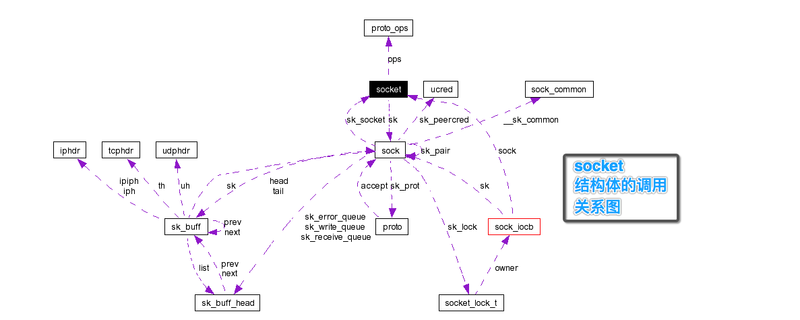

	本篇文章分析 socket 结构体的具体内容
	
## 1 socket 结构体的调用关系图



## 2 socket 结构体的说明

```cpp

套接字代表了一条通信链路的一端，存储了该端所有与通信有关的信息

这些信息包括：
1. 使用的协议
2. 套接字状态
3. 源和目的地址
4. 到达的连接队列
5. 数据缓存
6. 可选标志

```
## 3 socket 结构体的定义

```cpp
/*
 * net.h，孙小强，2016年11月30日17:08:11
 * struct socket 结构体的定义
 * line 00076
 */
 
struct socket {
	socket_state          	state;
	
#if 0
/* net.h */
00048 typedef enum {
00049         SS_FREE = 0,         /* 该套接字尚未分配，未使用                */
00050         SS_UNCONNECTED,      /* 该套接字未连接任何一个对端的套接字    */
00051         SS_CONNECTING,       /* 正在连接过程中     */
00052         SS_CONNECTED,        /* 已经连接一个套接字          */
00053         SS_DISCONNECTING     /* 正在断开连接的过程中  */
00054 } socket_state;
#endif 

	unsigned long		  	flags;

#if 0
/*net.h*/
00060 #define SOCK_ASYNC_NOSPACE      0 /*标识该套接字的发送队列是否已满*/
00061 #define SOCK_ASYNC_WAITDATA     1 /*标识应用程序通过 recv 调用时，是否在等待数据的接收*/
00062 #define SOCK_NOSPACE            2 /*标识非异步的情况下盖套接字的发送队列是否已满*/
#endif

	const struct proto_ops	*ops;

#if 0
/*net.h*/
00095 struct proto_ops {
00096         int             family;	/*协议族*/
00097         struct module   *owner;	/*所属模块*/
00098         int             (*release)   (struct socket *sock);	/*一组与套接字系统调用相应的传输层函数指针*/
......	/*同上，省略*/
00131 };
#endif

	struct fasync_struct  	*fasync_list;

#if 0
/*存储了异步通知队列*/
#endif

	struct file		      	*file;

#if 0
/*指向与该套接字相关的 file 结构的指针*/
#endif

	struct sock		      	*sk;

#if 0
/*指向了与该套接字关联的传输控制块*/
#endif	

	wait_queue_head_t     	wait;

#if 0
/*等待该套接字的进程队列*/
#endif	

	short			      	type;
	
#if 0
/*net.h*/
enum sock_type {
	SOCK_STREAM	= 1,		/*基于连接的套接字*/
	SOCK_DGRAM	= 2,		/*基于数据报的套接字*/
	SOCK_RAW	= 3,		/*原始套接字*/
	SOCK_RDM	= 4,		/*可靠传输报文套接字*/
	SOCK_SEQPACKET	= 5,	/*顺序分组套接字*/
	SOCK_DCCP	= 6,		/*数据报拥塞控制协议套接字*/
	SOCK_PACKET	= 10,		/*混杂模式套接字*/
};
#endif
};
```


