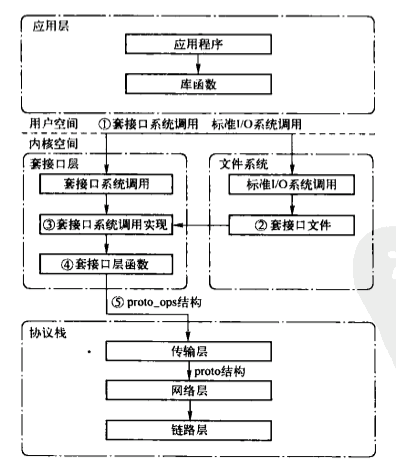
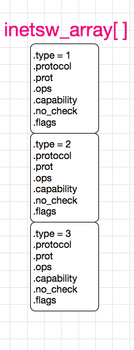
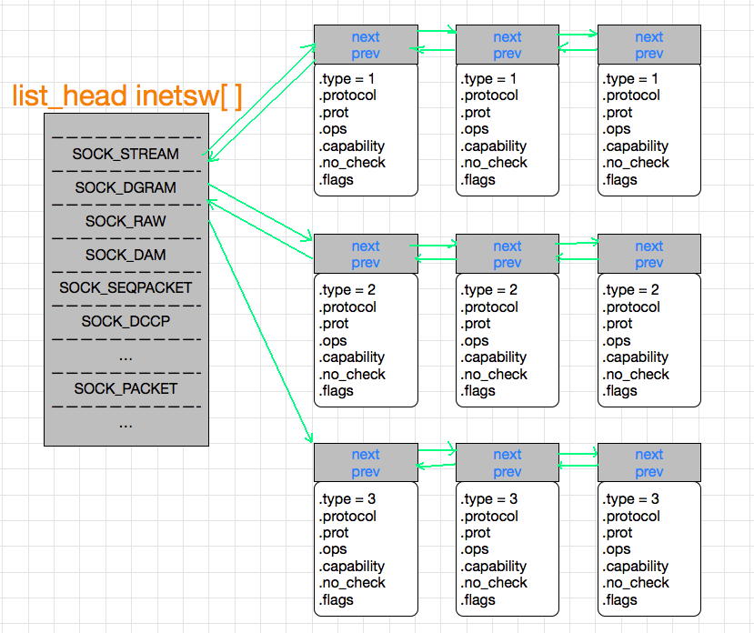

# 套接字层的基本数据结构

0. [socket.h](./socket.h)中存放了一下结构体的定义
1. 套接字层位于应用程序与协议栈之间
2. 对应用程序屏蔽了与协议相关实现的具体细节
3. 将应用程序发送的与协议无关的请求映射到与协议相关的实现
4. 不同协议都对应一个 proto_ops 结构，这个结构实现了套接字层函数到传输层函数的映射
5. 套接字层将一般的请求转换为指定的协议操作

### 1. struct socket 

- `socket_state          	state;`
	
		用于表示套接字所处的状态，该标志有些状态只对 TCP 套接字有作用
		因为只有 TCP 是面向连接的协议，有状态转换的过程
	
	- state 的取值

	|state|描述|
	|:---|---:|
	|SS_FREE|该套接字尚未分配，未使用|
	|SS_UNCONNECTED|盖套接字未连接任何一个对端的套接字|
	|SS_CONNECTING|正在连接过程中|
	|SS_CONECTED|已经连接一个套接字|
	|SS_DISCONNECTING|正在断开连接的过程中|
	
- `unsigned long		  	flags;`
	
	- falgs 的取值
	
	|flags|描述|
	|:---|---:|
	|SOCK_ ASYNC_NOSPACE|标识该套接字的发送队列是否已满|
	|SOCK_ ASYNC_WAITDATA|标识应用程序通过 recv 调用时，是否在等待数据的接收|
	|SOCK_ NOSPACE|标识非异步的情况下盖套接字的发送队列是否已满|
	|SOCK_ PASSCRED|标识是否设置了 SO_PASSCRE 套接字选项|
	|SOCK_ PASSSEC|标识是否设置了 SO_PASSSEC 选项|
	
	
- `const struct proto_ops	*ops;`
	
		指向套接字系统调用中选择对应类型的套接字接口
		用于将套接字系统调用映射相应的传输层的实现

	- 三种 proto_ops 结构实例
	
	|套接字类型|对应的 proto_ops 结构体实例|
	|:---|---:|
	|TCP| inet_ stream_ops |
	|UDP| inet_ dgram_ops |
	|RAW| inet_ sockraw_ops |

- `struct fasync_struct  	*fasync_list;`

	存储了异步的通知队列
	
- `struct file		      	*file;`

	指向与该套接字相关的 file 结构的指针

- `struct sock		      	*sk;`

	指向了与该套接字关联的传输控制块

- `wait_queue_head_t     	wait;`

	等待该套接字的进程队列

- `short			      	type;`

	- 套接字的类型

	|type|描述|
	|:---|---:|
	|SOCK_STREAM|基于连接的套接字|
	|SOCK_DGRAM|基于数据报的套接字|
	|SOCK_RAW|原始套接字|
	|SOCK_RDM|可靠传输报文套接字|
	|SOCK_SEQPACKET|顺序分组套接字|
	|SOCK_DECCP|数据报拥塞控制协议套接字|
	|SOCK_PACKET|混杂模式套接字|
	

### 2. struct inet_protosw

- `struct list_head         list;`

		标识当前结构体要添加到静态数组 inetsw[] 的地址

- `unsigned short           type;`

		标识了套接字类型

- `int                      protocol;`

		标识了传输层协议的类型

- `struct proto             *prot;`

		由传输层到网络层映射的结构体指针

- `const struct proto_ops   *ops; `  

		有套接字层到传输层映射的结构体指针
 
- `int                      capability; `

		操作这类别套接字所需要的权限

- `char                     no_check; `

		套接字对应的传输模块是否需要校验

- `unsigned char            flags;` 

	- flags的可能取值

	|flags|描述|
	|:---|---:|
	|INET_PROTOSW_REUSE|表示端口是否可重用|
	

### 2.1 inetsw_array[]
	
	1. 该数组中定义了协议族对应的所有的 inet_protosw 结构体
	2. 其对应的偏移是传输层协议对应的整型值

### 2.2 inetsw[]

	一个全局的 list_head 结构体数组,list_head结构体中有 指向前驱和后继的两个指针
	
1. 网络子系统初始化时，根据每一个inet_protosw结构的type类型，注册到 inetsw[] 中以其对应的元素为链表组成的一个双向链表中
2. 当需要创建套接字是，在inetsw[]中搜索匹配的inet_protosw结构体
	- 将其中的 ops 成员存储在 socket 结构体的 ops 中，**ops** 为 **struct proto_ops**，**由套接字层到传输层映射的结构体指针**
	- 将其中的 proto 成员存储在 sock 结构体的 sk_prot 中， **sk_prot** 为 **struct proto**，**由传输层到网络层映射的结构体指针**

### 3. struct proto_ops
	1. 该结构体中 **family** 表示协议族，module 结构体表示成员 **owner** 表示所属模块
	2. 剩下的一组与套接字系统工地阿勇相对应的传输层函数指针，可以看成一个套接字系统调用到传输层函数的跳转表
	3. 这些结构体成员被初始化后，放在了 socket 结构体中的 ops 中

