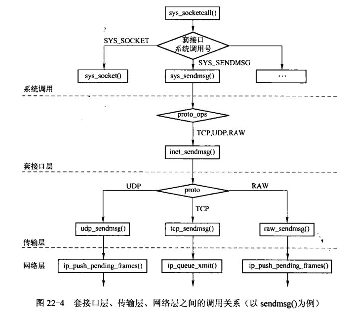

## 1. 套接字基础

### 1.1 系统调用入口

进程与内核交互是通过一组定义好的函数函数来进行的，这些函数成为系统调用。

### 1.2 系统调用机制（linux在i386上的实现）

1.  每一个系统调用均被编号， 成为系统调用号
2.  当进程进行一个系统调用时， 要通过终端指令 **INT 80H**, 从用户空间进入内核空间，并将系统调用号作为参数传递给内核函数
3.  在 linux 系统中所有的系统调用都会进入系统的同一个地址， 这个地址称为 **system_call**
4.  最终根据系统调用号， 调用系统调用表 **sys_call_table** 中的某一个函数
5. socket系统调用在套接字层、传输层、网络层之间的调用关系（以 `sendmsg()` 为例）

### 1.3 套接字的系统调用

- **建立**
	- `socket`:	 	在指明的通信域内产生一个 未命名 的套接字
	- `bind`:		 	分配一个本地地址给套接字
- **服务器** 	
	- `listen`:	 	套接字准备接收连接请求
	- `accept`:	 	等待接受连接
- **客户** 	
	- `connect`: 	 	同外部套接字建立连接
- **输入** 	
	- `read`:		 	接收数据到一个缓冲区
	- `readv`: 	 	接收数据到多个缓冲区
	- `recv`: 	 	指明选项接收数据
	- `recvfrom`:  	接收数据和发送者的地址
	- `redvmsg`:	 	接收数据到多个缓存中, 接收控制信息和发送者地址;指明接收选项
- **输出** 	
	- `write`:	 	发送一个缓冲区的数据
	- `writev`:	 	发送多个缓冲区的数据
	- `send`:		 	指明选项发送数据
	- `secdto`:	 	发送数据到指明的地址
	- `sendmsg`:	 	从多个缓存发送数据和控制信息到指明的地址; 指明发送选项
- **I/O**
	- `select`: 	 	等待 I/O 事件
- **终止** 	
	- `shutdown`:  	终止一个或者连个方向上的连接
	- `close`: 	 	终止连接并释放套接字
- **管理** 	
	- `fcntl`: 	 	修改 I/O 语义
	- `ioctl`:	 	各类套接字的操作
	- `setsockopt`:	设置套接字或者协议选项
	- `getsockopt`:	获得套接字或者协议选项
	- `getsockname`:	得到分配给套接字的本地地址
	- `getpeername`:	得到分配给套接字的远端地址

### 1.4 socket系统调用号

	
	
### 1.5 `sys_socketcall()`
		系统中所有的 socket 系统调用总入口为 sys_socketcall() 有两个参数 call , args
		
- **参数说明**

	- **call**，  **操作码**，函数中通过操作码跳转到真正的系统调用函数
	- **args**， **指向一个数组的指针 **，指向用户空间，表示系统调用的参数

- **工作流程**

0. [compat.c/compat_sys_socketcall()](./compat.c)中注释了源代码
1. 判断参数 call 是否在操作码所表示的范围内
2. 将参数 args 所表示的用户空间的数据（ 总共`nas(call)`,nas定义在[compat.c](./compat.c)文件中 ）个拷贝到内核空间的变量中
3. 通过一个 `switch(call)`，如果不同的操作码来调用相应的套接字的系统调用（如：`sys_socket()`, `sys_bind()`,etc）
4. 该函数的返回结果就是以上系统调用的返回结果
5. call 参数所代表的不同的系统调用的**通常**调用流程图

-----------------------------------------------------------------------

## 2. `socket`系统调用

----
### 2.1 `sys_socket()`
	sys_socket() 把套接字的创建 和
	与此套接字关联的文件描述符的分配做了简单的封装，完成创建套接字的功能

 - **参数说明**

	- **family**,  待创建套接字的协议族，如 *PF_INET, `PF_UNIX*
	- **type**, 待创建套接字的类型，如*SOCK_STREAM, SOCK_DGRAM, SOCK_RAW* 等
	- **protocol**，传输层协议，如*IPPROTO_TCP, IPPROTO_UDP*等

- **工作流程**

0. [sys_socket.c/SYSCALL_DEFINE3()](./sys_socket.c)中注释了源码
1. 创建一个 `struct socket` 类型的指针 `sock`
2. 将 `sock` 的地址传入 `sock_create()`
	- `sock_create()`函数内部调用 `__sock_create()`
		- 首先调用`sock_alloc()`
		- 调用`pf->create()`
			- `sk_alloc()`
			- `sk->sk_prot->hash()`, TCP: `tcp_v4_hash()`, RAW: `raw_v4_hash()`
			- `sk->sk_prot->init()`, TCP: `tcp_v4_init_sock()`, RAW: `raw_init()`
	- `sock_map_fd()` 为创建好的套接字分配一个文件描述符，并绑定
3. 返回错误值
	
##  2.2 `__sock_create()`
	sock_create() 内部对__sock_create() 做了调用，

- **参数说明**

	- **family**,  待创建套接字的协议族，如 *PF_INET, `PF_UNIX*
	- **type**, 待创建套接字的类型，如*SOCK_STREAM, SOCK_DGRAM, SOCK_RAW* 等
	- **protocol**，传输层协议，如*IPPROTO_TCP, IPPROTO_UDP*等
	- **res**,  表示的就是上述的 *struct socket*结构体指针的地址, 用来输出套接字
	- **kern** ， 用来表示创建套接字的是内核还是普通进程

- **工作流程**

0. [sys_socket.c/__sock_create() ](./sys_socket.c),中注释了源码
1. 检查`family`， `type` 是否合法范围内
2. 由于`SOCK_PACKET`类型的套接字已经废除， 而在系统外增加一个`PF_PACKET`类型的协议族，将前者强转成后者
3. 安全模块对台阶自的创建做检查 , `security_socket_create()`
4. `sock_alloc()` 在 `sock_inode_cache` 缓存中分配 **i节点** 和 **套接字**，同时初始化 i节点 和 套接字（ **i节点用来标识此文件并与套接字关联，让套接字可以向一般的文件对他进行读写）**，如果分配失败则会给出警告：`socket: no more sockets`，并根*据套接字的类型参数设置创建的套接字的类型*
5. 根据参数`family` 获取已经注册在`net_families`中的对应的`net_proto_family`指针( **pf** ),*需要读写锁的保护*
6. `try_module_get(net_families[family])`,`family` 标识的类型的协议族`net_proto_family`是以内核模块加载并**动态**注册到net_families中，则需要对内核模块引用计数加一，防止创建过程中此内核模块被动态卸载， 并对读写锁解锁
7. `pf->create(sock, protocol)`, 继续对套接字初始化（调用IPv4协议族中的**inet_create()**），同时创建传输控制块
8. `try_module_get(sock->ops->owner)`, 如果`sock->ops`是以内核模块的方式动态加载，并且注册到内核中的，则需要对内核模块引用计数加一（ ），防止创建过程中此内核模块被动态卸载
9. `module_put(pf->owner)`, 完成对IPv4协议族中的`inet_create()`调用完后，对模块的引用计数减一, 进行一系列错误检查创建完成
	
### 2.3 `inet_create()`
		 与协议族有关的套接字以及传输控制块创建过程在这个函数之后全部结束
		 返回到创建套接字的统一接口中

- **参数说明**

	- **sock**， 已经在__sock_create()中创建的套接字
	- **protocol**， 表示创建套接字的协议号

- **工作流程**

0. [sys_socket.c/inet_create() ](./sys_socket.c),中注释了源码
1. `sock->state = SS_UNCONNECTED`, 将套接字的状态注册成**SS_UNCONNECTED**
2. `list_for_each_rcu(),`**将sock->type作为关键字遍历inetsw散列表**
3. `list_entry()`，通过计算偏移的方法获取指向 inet_protosw 的结果的指针
4. 根据参数类型获取匹配的 inet_protosw 结构体的实例
5. 如果不能再 inetsw 中获得匹配的 inet_protosw 结构的实例，则需加载相应的内核模块，再返回第五步，（最多尝试两次，失败则会退出）
6. 判断当前进程是否有*answer->capability*（保存在进程的描述符中国）的能力，如果没有则不能创建套接字
7. `sock->ops = answer->ops`, 用来设置套接字层 和 传输层之间的接口ops
8. `sk_alloc()`, 用来**分配一个传输控制块**，返回值放在**sk**中
9. 设置传输模块是否需要校验(**sk->sk_no_check**) 和 是否可以重用地址和端口标志（**sk->sk_reuse**）
10. 设置 **inet_sock** 块中的 **is_icsk** ,用来标识是否为面向连接的传输控制块
11. 如果套接字为原始类型，则设置本地端口为协议号 并且 **inet->hdrincl** 表示需要自己构建 IP 首部
12. 设置传输模块是否支持 PMTU(动态发现因特网上任意一条路径的最大传输单元(MTU)的技术)
13. `sock_init_data(sock, sk)`, 对传输控制块进行了初始化。
14. 初始化**sk->destruct**, 在套接字释放时回调，用来清理和回收资源，设置传输控制字协议族(**sk->sk_family**)和协议号标识(**sk->sk_protocol**)
15. 设置传输控制块 单播的TTL, 是否法相回路标志，组播TTL, 组播使用的本地接口索引，传输控制块组播列表
16. 如果传输控制块中的num设置了本地端口号，则设置传输控制块中的sport网络字节序格式的本地端口号； **调用传输层接口上的hash(),把传输控制块加入到管理的散列表中**；（TCP: `tcp_v4_hash()`, UDP:`udp_lib_hash()`）
17. 如果sk->sk_prot->init指针已经被设置，则会调用sk->sk_prot->init(sk)来进行具体传输控制块的初始化（TCP: `tcp_v4_init_sock()`,无UDP）

--------------------------------------------------------------------------------				
 
## 3. `bind` 系统调用

### 3.1 `sys_bind()`
		bind 系统调用将一个本地的地址 及 传输层的端口 和 套接字 关联起来
		一般作为客户端进程并不关心它的本地地址和端口是什么，所以没有必要调用 bind()
		，内核将会自动为其选择一个本地地址和端口
		
- **参数说明**

	- **fd**, 进行绑定的套接字的文件描述符
	- **umayaddr**, 进行绑定的地址
	- **addrlen**，进行绑定地址的长度.(不同协议族的地址描述结构不一样， 所以需要长度)

- **工作流程**

0. [sys_socket.c/SYSCALL_DEFINE3()](./sys_socket.c)中注释了源码
1. 首先创建 **struct socket** 类型的指针 **sock**
2. `sockfd_lookup_light()`,  根据文件描述符 **fd** 获取套接字的指针， 并且返回是否需要对文件引用计数的标志(fput_needed)
3. `move_addr_to_kernel(umyaddr, addrlen, address)`,  **address**字符型数组用来保存地址从用户空间传进来的绑定地址
4. `security_socket_bind()`，安全模块对套接字bind做检查
5. `sock->ops->bind()`, 在 **inet_create()** 第 8 步中设置了套接字层与传输层之间的接口 **ops** ,所有类型的套接字的 bind 接口是统一的即 `inet_bind()` ，他将实现传输层接口 bind 的有关调用
	- **RAW:** `sk->sk_prot->bind()` ---> `raw_bind()`
	- **TCP/UDP:** `sk->sk_prot->get_port()`
		- **TCP:** `tcp_v4_get_port()`
		- **UCP:** `rdp_v4_get_port()`
6. `fput_light()`, 根据第二步中获得标志， 对文件的引用计数进行操作

### 3.2 `inet_bind()`
	所有类型的套接字的 bind 接口是统一的即 `inet_bind()`
	他将实现传输层接口 bind 的有关调用， 是 bind 系统调用的套接字层的实现

- **参数说明**

	- **sock**, 套接字指针类型，`sys_bind()` 中根据 fd 获得的套接字指针
	- **uaddr**, 绑定地址，`struct sockaddr` 结构体类型指针，即	`（struct sockaddr *）address` , address 是一个字符数组从 用户空间  拷贝到 内核空间
	- **addr_len**, 绑定地址的长度

- **工作流程**

0. [sys_socket.c/inet_bind()](./sys_socket.c)中注释了源码
1. **addr**、**sk** 、**inet**指针， 分别是`（struct socketaddr_in）uaddr`、`sock->sk` 、`inet_sk(sk)`
2. `sk->sk_prot`, 在`inet_create()` 中 `sk_alloc()` 中被初始化，如果是TCP套接字该值就是**tcp_prot**，只有RAW 类型（**SOCK_RAW**）的套接字才可以直接调用传输层接口上的 bind()， 即当前套接字在传输层接口上有 bind 的实现( `raw_bind()` )，`sk->sk_prot->bind` 为真，完成后可以直接返回
3. 若没有 bind 的实现，则需要对绑定地址的长度进行合法性检查
4. `inet_addr_type(addr->sin_addr.sin_addr)`， 根据**绑定地址中的地址参数**得到地址的类型(组播，广播，单播...)
5. 对上一步得到的地址类型进行检查，判断是否可以进行地址和端口的绑定
6. 将绑定地址中的网络字节序的端口号转换成本机的字节序，并对端口进行合法性校验，并且还要判断是否允许绑定小于1024的特权端口，保存在 **snum** 中
7. `sk->sk_state != TCP_CLOSE || inet->inet_num`, 如果套接字的状态不是TCP_CLOSE或者已经是绑定过的套接字则会返回错误
8. `inet->inet_rcv_saddr = inet->inet_saddr = addr->sin_addr.s_addr`,   将传入的绑定地址设置到传输控制块中
9. `sk->sk_prot->get_port(sk, snum)`,  调用传输层 `get_port`进行具体的传输层的地址绑定，该 **get_port()** 对应的**TCP:** `tcp_v4_get_port()`, **UCP:** `rdp_v4_get_port()`
10. `sk->sk_userlocks |= SOCK_BINDADDR_LOCK;sk->sk_userlocks |= SOCK_BINDPORT_LOCK;`   标识了传输控制块已经绑定了 **本地地址** 和 **本地端口**
11. `inet->sport = htons(inet->num)` 设置本地端口.   再初始化目的地址和目的端口为0

-------------

## 4. `listen` 系统调用

### 4.1 `sys_listen()` 
		1. listen 系统调用用于通知进程准备接受套接字上的连接请求
		2. 它同时制定套接字上可以等待的连接数的门限值
		3. 超过门限值时，套接字将拒绝新的连接请求，TCP将忽略进入的连接请求

- **参数说明**

	- **fd**, 进行监听的套接字
	- **backlog**, 指定连接队列长度的最大值

- **工作流程**
	
0. [sys_socket.c/SYSCALL_DEFINE2( )](./sys_socket.c)中注释了源码
1. 首先创建 **struct socket** 类型的指针 **sock**
2. `sockfd_lookup_light()`,  根据文件描述符 **fd** 获取套接字的指针， 并且返回是否需要对文件引用计数的标志
3. 如果 backlog 的值大于系统设置的门限值( 128 )，将 backlog 设为系统门限的最大值
4. 安全模块对套接字的 listen 做检查
5. 通过套接字与接口层的接口 sock->ops 来调用传输层的 listen 操作
	- **SOCK_DGRAM 和 SOCK_RAW 类型不支持 listen**
	- **SOCK_STREAM 类型支持 listen， TCP对应的是** `inet_listen()`
6. `fput_light()`, 根据第二步中获得标志， 对文件的引用计数进行操作

###4.2 `inet_listen()`
		1. inet_listen() 函数首先对调用 listen 的套接字当前状态和类型进行检查
		2. 如果套接字状态不是 SS_UNCONNECTED， 或者类型不是 SOCK_STREAM，则返回错误
		3. 调用 inet_csk_listen_start()
		4. 将请求队列长度的最大值设置为 backlog(或者是系统最大值)

###4.3  `inet_csk_listen_start()`
		1. 申请管理连接请求块的空间
		2. 将套接字状态改为监听
		3. 将传输控制块加入到请求列表中完成监听

- **参数说明**

	- **sk**, 套接字结构体中的 sk  成员变量 (struct sock*)
	- **nr_table_entries**, 指定连接队列长度的最大值

- **工作流程**

0. [sys_socket.c/inet_csk_listen_start( )](./sys_socket.c)中注释了源码
1. 	`struct inet_sock *inet = inet_sk(sk)`
	`struct inet_connection_sock *icsk = inet_csk(sk)`
2. `reqsk_queue_alloc()`, 为管理连接请求块的散列表分配存储空间(**nr_table_entries**个)，如果分配失败就返回错误
3. 将**连接队列的上限值**（`sk->sk_max_ack_backlog = 0`
） 和 **已经建立连接数**（`sk->sk_ack_backlog = 0`） 清零
4. `inet_csk_delack_init(sk)`, 初始化传输控制块中与演示发送ACK段有关的控制数据结构**icsk_ack**
5. `sk->sk_state = TCP_LISTEN`,  **将传输控制块的状态置为监听状态, TCP_LISTEN**
6. `sk->sk_prot->get_port(sk, inet->num)`,  通过传输控制块和端口号来判断是否绑定端口
	- 如果端口是没有绑定，则进行绑定操作，绑定成功，返回0
	- 如果绑定了，则对绑定的端口进行校验，校验成功，返回0
7. 如果第六步成功
	- 根据端口号(`inet->num`)设置传输控制块中的端口号成员(`inet->sport` 网络字节序)
	- `sk_dst_reset(sk)`, 清空缓存在传输控制块中的目的路有缓存
	- `sk->sk_prot->hash(sk)`，调用hash接口的 inet_hash() 将传输控制块添加到监听散列表中（listening_hash）,完成监听
8. 如果第六步失败，  套接字类型改为 **TCP_CLOSE**, 释放申请到的管理连接请求块的是你列表存储空间
	

## 5. `accept` 系统调用

###  5.1 `sys_accept()`
	调用listen()后，便可以调用accept()等待连接请求
	accept()返回一个新的文件描述符，指向一个连接到客户的新的套接字文件
	这个套接字坦然是未连接的，并要准备接受下一个连接

- ** 参数说明 **
	-  **fd**, 用来表示套接字的文件描述符
	-  ** * upeer_sockaddr **, 用户空间自定义的、用来获取客户方socket地址的指针变量
	-  ** * upeer_addrlen ** ，socket地址的长度的指针

- ** 工作流程 **
0. [sys_socket.c/SYSCALL_DEFINE4( )](./sys_socket.c)中注释了源码
1. `sockfd_lookup_light(fd)`,  根据文件描述符 **fd** 获取套接字的指针， 并且返回是否需要对文件引用计数的标志(fput_needed)
2. **newsock**，调用 `sock_alloc()` 分配一个新的套接字，用来处理客户端的连接
3. 套接字的类型（`newsock->type`）和 **套接字的系统调用的跳转表**（`newsock->ops`）都有原来的 **sock** 给出
4. `_module_get(newsock->ops->owner)`, 如果`newsock->ops`是以内核模块的方式动态加载，并且注册到内核中的，则需要对内核模块引用计数加一（ ），防止创建过程中此内核模块被动态卸载
5. `sock_alloc_fd(&newfile)`，该函数为 **newsock** 分配一个文件描述符（返回结果为一个新的文件描述符，*newfile 是一个 struct file 结构体变量*）
6. `sock_attach_fd(newsock, newfile)`，将新的套接字与引得文件描述符绑定
7. `security_socket_accept()`，安全模块对套接字的accept做检查
8. `sock->ops->accept()`，是通过套接字的系统调用的跳转表结构体(**sock->ops**)来调用相应的传输协议的accept操作，SOCK_DGRAM 和 SOCK_RAW 类型不支持 accept 接口，只有SOCK_STREAM 类型支持， **TCP 实现的函数为** `inet_accept()`
9. `newsock->ops->getname()`, 如果需要获取客户方套接字的地址， 该操作如果成功就把获得地址拷贝到用户空间参数 **upeer_sockaddr** 指向的变量中，同时还有地址长度
10. `fd_install(newfd, newfile)`,  将获得的文件描述符加入到当前进程已经打开的文件列表中，完成文件与进程的关联
11. `fput_light()`, 根据第二步中获得标志， 对文件的引用计数进行操作,并返回文件描述符

###  5.2 `inet_accept()`
	通过调用 inet_csk_accept() 来获得一个已经三次握手过的传输控制块
	将该传输控制块和新的套接字关联起来

- ** 参数说明 **

	- **sock**,  旧的套接字
	- **newsock**, 新的套接字
	- **flags**, 旧的套接字的文件描述符的标志(`sock->file->flags`)

- **工作流程**

0. [sys_socket.c/inet_accept( )](./sys_socket.c)中注释了源码
1. 从原来的套接字中获得传输控制块的指针 **sk1**
2. `sk1->sk_prot->accept ( )`,  调用 accept 的传输层接口实现`inet_csk_accept()`来获取**已完成连接（被接受）**的传输控制块（**sk2**），（**三次握手创建一个传输控制块**）
3. `sock_graft(newsock, sk2)`, 用该函数将 newsock 和 sk2 关联起来
4. 将新的套接字的状态(**newsock->state**)修改为 **SS_CONNECTED**

### 5.3 `inet_csk_accept()`
	从接受连接请求的队列中拿出一个传输控制块返回给新的套接字用来关联起来
- **参数说明**

	-   **sk**，新套接字对应的传输控制块
	-   **flags** ，就套接字对应的文件描述符标志
	-   **err**，错误信息

- **工作流程**
	
0. [sys_socket.c/inet_csk_accept( )](./sys_socket.c)中注释了源码
1. 对套接字的状态进行检查，当前的套接字必须是TCP_LISTEN状态
2. `reqsk_queue_empty(&icsk->icsk_accept_queue)`
	- **icsk**, 连接套接字的结构体类型，其中包含一个**icsk_accept_queue**
	- **icsk_accept_queue**, 该队列中的已接受的成员是在 **tcp_v4_request()**中**inet_csk_reqst_queue_hash_add()** 函数添加进去的
	- 如果该队列为空则表示没有接受到连接，否为接受到了连接
3. 如果没有接受到连接，利用`sock_rcvtimeo()` 函数来获得套接字阻塞时间 **timeo**
	- 如果该套接字是非阻塞的，则直接返回无需睡眠等待
	- 如果该套接字是阻塞的，调用`inet_csk_wait_for_connect(sk, timeo)`，等待**timeo** 时间
4. `reqsk_queue_get_child()`, 此处应该接受到了连接，用该函数从已接受的连接中取出传输控制块（**newsk**）
5. `WARN_ON(newsk->sk_state == TCP_SYN_RECV)`，如果此时的套接字状态是**SYN_RECV** 则会发出警告，因为已经完成了三次握手此时的状态应处于**ESTABLISHED**状态

----------------------

## 6. `connect` 系统调用
 

### 6.1 `sys_connect()`
	1. connect() 建立一条与指定的外部地址的连接
	2. 如果在connect() 调用之前没有绑定地址和端口，则会自动绑定一个地址和端口到套接字
	3. IP地址是 tcp_v4_connect() 根据本地路由表分配的
	4. 端口地址是由 inet_hash_connect() 中指定

- **参数说明**

	- fd，套接字绑定的文件描述符
	- uservaddr，要连接的套接字地址
	- addrlen，套接字的长度

- **工作流程**
	
0. [sys_socket.c/sys_connect( )](./sys_socket.c)中注释了源码
1. `sockfd_lookup_light(fd)`,  首先根据文件描述符 **fd** 获取套接字的指针（**sock**）， 并且返回是否需要对文件引用计数的标志(**fput_needed**)
2. `move_addr_to_kernel( )`, 将用户空间的套接字地址 **uservaddr** 拷贝到 内核空间(address)
3. 安全模块对套接字接口的 connect 做检查
4.  通过套接字系统调用的跳转表调用对应的传输协议的 connect 操作

	- **TCP:** `inet_stream_connect()`
	- **UDP:** `inet_dgram_connect()`

5. `fput_light()`, 根据第二步中获得标志， 对文件的引用计数进行操作,并返回文件描述符

### 6.2 `inet_stream_connect()`
		套接字层调用传输接口层的 tcp_v4_connect() 完成连接

- **参数说明**

	- **sock**，目标套接字
	- **uaddr**，目标套接字的地址
	- **addr_len**，套接字地址的长度
	- **flags**，套接字对应文件描述符的标志位

- **工作流程**

0. [sys_socket.c/inet_stream_connect( )](./sys_socket.c)中注释了源码
1. 根据 **sock->sk** 得到传输控制块（**sk**）
2. 只有在套接字状态处于 **SS_UNCONNECTED** 状态 并且 传输控制块的状态为 **!TCP_CLOSE** 状态时 才会调用传输控制块上的 connect 接口

	- **TCP:** `tcp_v4_connect(sk, uaddr, addr_len)`

3. connect 成功后将套接字的状态置为 **SS_CONNECTING**
4. `sock_sndtimeo(sk, flags & O_NONBLOCK)`，获取套接字的阻塞时间（**timeo**）
5. 如果传输模块状态是 **TCPF_SYN_SENT** 或者 **TCPF_SYN_RECV** 时
	- **如果套接字是阻塞，等待timeo时间后，释放传输模块再退出**
	- **如果套接字是非阻塞，释放传输模块直接退出**
6. 如果套接字不是以上的状态时， **再次判断传输模块是否为 TCP_CLOSE** ，防止( 中间判断的时候 产生 RST, 超时，ICMP 错误等是的连接关闭 )
7. 将套接字状态修改为 **SS_CONNECTED**成功返回

### 6.2 `tcp_v4_connect()`
	1. 获取目标路由缓存，设置相关属性
	2. 为没有绑定地址和端口的套接字分配地址和端口
	3. 修改相关状态，并发送同步数据块

- **参数说明**

	- **sk**，传输控制块
	- **uaddr**，目标套接字地址
	- **addr_len**，目标套接字地址长度

- **工作流程**

0. [sys_socket.c/tcp_v4_connect( )](./sys_socket.c)中注释了源码
1. 参数有效范围判断
	- **套接字地址长度 应>= 专用套接字的地址长度**
	- **sin_family 应 == AF_INET**
2. 将目标套接字地址转为专用套接字地址，再从中获得 IP地址（**nexthop, daddr**）
3. `ip_route_connect()`，调用该函数根据下一跳地址等信息查找目标路由缓存，如果路由查找命中，则生成一个相应的**路由缓存项(rt)**，缓存项不但可以直接用于当前待发送SYN段，而且还对后续的所有数据包都可以起到加速路由查找的作用
4. TCP 不能使用类型为组播或多播的路由缓存项目
5. 如果没有启用源路由选项 则使用获取到的 **路由选项中的目的地址**(`daddr = rt->rt_dst`)
6. 如果客户端没有本方在 connect 前没有指明套接字的IP地址（`inet->inet_saddr` 为空），就会在这里设置
	-  `inet->inet_saddr = rt->rt_src;` **源地址**
	-  `inet->inet_rcv_saddr = inet->inet_saddr;` **本方接收地址**
7. 如果传输控制块中的时间戳 和 目的地址已经被使用过，则说明传输控制块已经建立过连接并进行过通讯，则需重新初始化它们
8. 给传输控制块初始化 对端端口 和 地址
9. 将TCP 状态设置为 **SYN_SEND** ，动态绑定一个本地端口，并将传输控制块添加到散列表中，由于在动态分配端口时，如果找到的是已经使用过端口，则需要在TIME_WAIT状态中进行相应的确认，因此调用 `inet_hash_connect()` 时需要TIMEWAIT传输控制块和参数管理器**tcp_death_row**作为参数
10. `ip_route_newports()`，在路由表中重新缓存表中重新设置本地端口到目标端口的映射关系
11. 根据传输控制块的路由输出设置特性 来设置 传输控制块中的路由网络设备的特性
12. `secure_tcp_sequence_number()`，如果**write_seq**字段值为零，则说明传输控制块还没有设置初始序号，因此需要根据双发的地址端口计算初始序列号，同时根据发送需要 和当前时间得到用于设置IP首部ID域的值
13. `tcp_connect(sk)`，构造并发送 SYN 段,等待一段时间来接受对端 answer

### 6.3 `inet_dgram_connect()`
	保证参数的正确性，并且绑定端口再调用给你传输控制块层的 connect 接口函数来完成connect

- **参数说明**

	- **sock**，目标套接字
	- **uaddr**，目标套接字的地址
	- **addr_len**，套接字地址的长度
	- **flags**，套接字对应文件描述符的标志位

- **工作流程**

0. [sys_socket.c/inet_dgram_connect( )](./sys_socket.c)中注释了源码
1. 根据参数 **sock** 获得传输控制块 **sk**
2. 对参数的合法性进行判断
3. `inet_autobind(sk)`, 如果传输控制块绑定个数为零, 就调用该函数为传输控制块绑定一个端口号
4. 最后个调用传输控制块层的 connect 接口函数 `ip4_datagram_connect()` 来完成connect 

### 6.4 `ip4_datagram_connect()`

- **参数说明**

	- **sk**, 套接字对应的传输控制块
	- **uaddr**，目标套接字的地址
	- **addr_len**，套接字地址的长度
	
- **工作流程**

0. [sys_socket.c/ip4_datagram_connect( )](./sys_socket.c)中注释了源码
1. 根据参数 **sk** 得到符合ipv4的传输控制块 **inet**，根据 **uaddr** 获得专用套接字地址 **usin**, 以及缓存内的路由表项 **rt**
2. 判断参数的合法性，套接字协议族必须为 **AF_INET**
3. `sk_dst_reset(sk)`, 将传输控制块设置为目标传输控制块
4. 如果目标地址属于多播，就把相应的属性设置到变量当中
5. `ip_route_connect()`，调用该函数根据下一跳地址等信息查找目标路由缓存，如果路由查找命中，则生成一个相应的**路由缓存项(rt)**，缓存项不但可以直接用于当前待发送SYN段，而且还对后续的所有数据包都可以起到加速路由查找的作用
6. 如果 connect 之前没有设置套接字地址，就将路由表项中的源地址和端口赋值给传输控制块 inet
7. 将传输控制块中的目标端口和地址 设置成 路由表项中的目的地址和目的端口
8. 将传输控制块 sk 的状态设置为 **TCP_ESTABLISHED**
9. 将传输控制块的目标地址 设置到 sk的目标地址

----------------------

## 7. `shutdown` 系统调用
 

### 7.1 `sys_shutdown()`
	1. shutdown 系统调用关闭所有连接的 读通道、写通道、读写通道
	2. 对于读通道， shutdown 丢弃所有还没有读走以及该调用之后到达的数据
	3. 对于写通道， shutdown 使用协议做相应的处理
		- 所有剩余的数据将被发送， 之后在发送 FIN
	4. shutdown 会关闭套接字的连接，即使是有多个进程都在共享这个套接字
	   close    会关闭套接字,如果还有其他的进程共享这个套接字，那么他们依然是打开的可以正常通信的

- **参数说明**

	- **fd**，与套接字相关联的文件描述符
	- **how**，关闭套接字的方式，0:关闭接受通道，1:关闭输出通道，2:同时关闭接收和输出通道

- **工作流程**
	
0. [sys_socket.c/SYSCALL_DEFINE( )](./sys_socket.c)中注释了源码
1. `sockfd_lookup_light(fd)`,  首先根据文件描述符 **fd** 获取套接字的指针（**sock**）， 并且返回是否需要对文件引用计数的标志(**fput_needed**)
2. 安全模块对 shutdown 操作进行安全检查
3. 根据套接字层的接口 **sock->ops** 来调用 `inet_shutdown`

### 7.2 `inet_shutdown()`

- **参数说明**

	- **sock**，与描述相关的套接字
	- **how**，关闭套接字的方式，0:关闭接受通道，1:关闭输出通道，2:同时关闭接收和输出通道

- **工作流程**

0. [sys_socket.c/inet_shutdown( )](./sys_socket.c)中注释了源码
1. 获取套接字的传输控制块 sk，接着对参数 how += 1 进行检查
2. 根据传输控制块的状态 sk->state 来设置套接字的状态,使之在关闭前只有两种状态
	- 如果传输控制块的状态 是 `TCPF_SYN_SENT | TCPF_SYN_RECV | TCPF_CLOSE`，就把套接字状态设置为 **SS_DISCONNECTING**
	- 如果不是就把套接字状态设置为 **SS_CONNECTED**
3. 如果传输控制块的状态处于其他状态，调用传输层接口的 shutdwon 进行具体的关闭操作，如果是 TCP 就调用 `tcp_shutdown(sk, how)`
4. 如果传输控制块的状态处于 **SYN_SENT** 则不允许继续连接，调用传输层接口的 disconnect 进行具体断开连接操作
5. 如果传输控制块的状态处于 **TCP_LISTEN** ,在判断是否为 SYN_SEND 看是否需要 调用 disconnect
6. `sk_state_change(sk)`, 唤醒在传输控制块的等待队列上的进程

### 7.3 `tcp_shutdown()`

- **参数说明**

	- **sk**，与描述相关的套接字的传输控制块
	- **how**，关闭套接字的方式，0:关闭接受通道，1:关闭输出通道，2:同时关闭接收和输出通道

- **工作流程**

0. [sys_socket.c/tcp_shutdown( )](./sys_socket.c)中注释了源码
1. **判断关闭方式是否为 1或者2**，如果不是则不需要关闭发送通道，因为发送 FIN 只是表示不再发送数据
2. 如果传输控制块具有 `TCPF_ESTABLISHED | TCPF_SYN_SENT | TCPF_SYN_RECV | TCPF_CLOSE_WAIT`这些状态；表示没有发送过 FIN、 或者传输控制块还没有关闭 ，就调用 `tcp_close_state()` 将传输控制块设置为关闭
3. 最后调用 `tcp_send_fin()` 来发送 `FIN`

