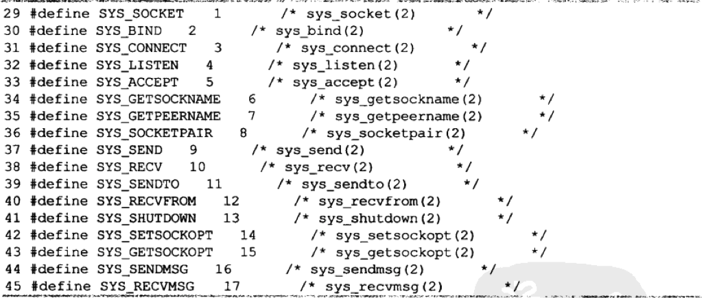
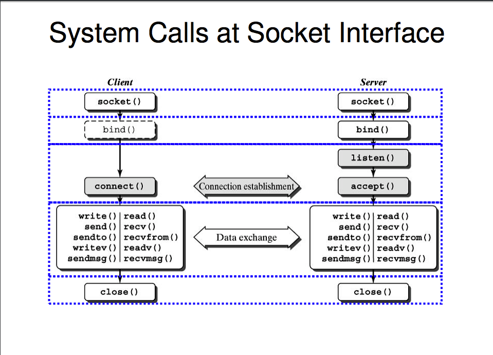

##系统调用入口

进程与内核交互是通过一组定义好的函数函数来进行的，这些函数成为系统调用。

##系统调用机制（linux在i386上的实现）

1.  每一个系统调用均被编号， 成为系统调用号
2.  当进程进行一个系统调用时， 要通过终端指令 **INT 80H**, 从用户空间进入内核空间，并将系统调用号作为参数传递给内核函数
3.  在 linux 系统中所有的系统调用都会进入系统的同一个地址， 这个地址称为 **system_call**
4.  最终根据系统调用号， 调用系统调用表 **sys_call_table** 中的某一个函数

##套接字的系统调用

- **建立**
	- socket:	 	在指明的通信域内产生一个 未命名 的套接字
	- bind:		 	分配一个本地地址给套接字
- **服务器** 	
	- liste:	 	套接字准备接收连接请求
	- accept:	 	等待接受连接
- **客户** 	
	- connect: 	 	同外部套接字建立连接
- **输入** 	
	- read:		 	接收数据到一个缓冲区
	- readv: 	 	接收数据到多个缓冲区
	- recv: 	 	指明选项接收数据
	- recvfrom:  	接收数据和发送者的地址
	- redvmsg:	 	接收数据到多个缓存中, 接收控制信息和发送者地址;指明接收选项
- **输出** 	
	- write:	 	发送一个缓冲区的数据
	- writev:	 	发送多个缓冲区的数据
	- send:		 	指明选项发送数据
	- secdto:	 	发送数据到指明的地址
	- sendmsg:	 	从多个缓存发送数据和控制信息到指明的地址; 指明发送选项
- **I/O**
	- select: 	 	等待 I/O 事件
- **终止** 	
	- shutdown:  	终止一个或者连个方向上的连接
	- close: 	 	终止连接并释放套接字
- **管理** 	
	- fcntl: 	 	修改 I/O 语义
	- ioctl:	 	各类套接字的操作
	- setsockopt:	设置套接字或者协议选项
	- getsockopt:	获得套接字或者协议选项
	- getsockname:	得到分配给套接字的本地地址
	- getpeername:	得到分配给套接字的远端地址

##socket系统调用号

	系统中所有的 socket 系统调用总入口为 sys_socketcall() 有两个参数 call , args

- **call**
	- **操作码**，函数中通过操作码跳转到真正的系统调用函数

- **args**
	- **指向一个数组的指针 **，指向用户空间，表示系统调用的参数

##`sys_socketcall`的工作流程

0. [compat.c/compat_sys_socketcall](./compat.c)中注释了源代码
1. 判断参数 call 是否在操作码所表示的范围内
2. 将参数 args 所表示的用户空间的数据（ 总共`nas(call)`,nas定义在[compat.c](./compat.c)文件中 ）个拷贝到内核空间的变量中
3. 通过一个 `switch(call)`，如果不同的操作码来调用相应的套接字的系统调用（如：`sys_socket()`, `sys_bind()`,etc）
4. 该函数的返回结果就是以上系统调用的返回结果
5. call 参数所代表的不同的系统调用的通常调用流程图

-----------------------------------------------------------------------

-----------------------------------------------------------------------
